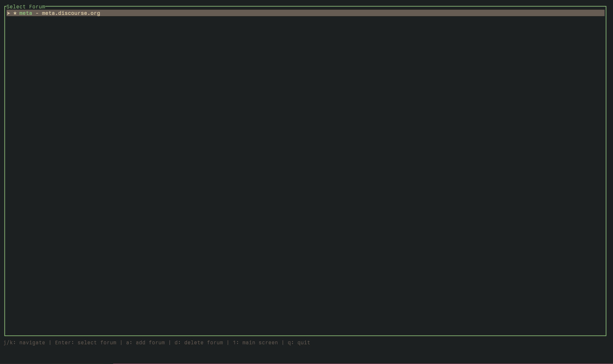
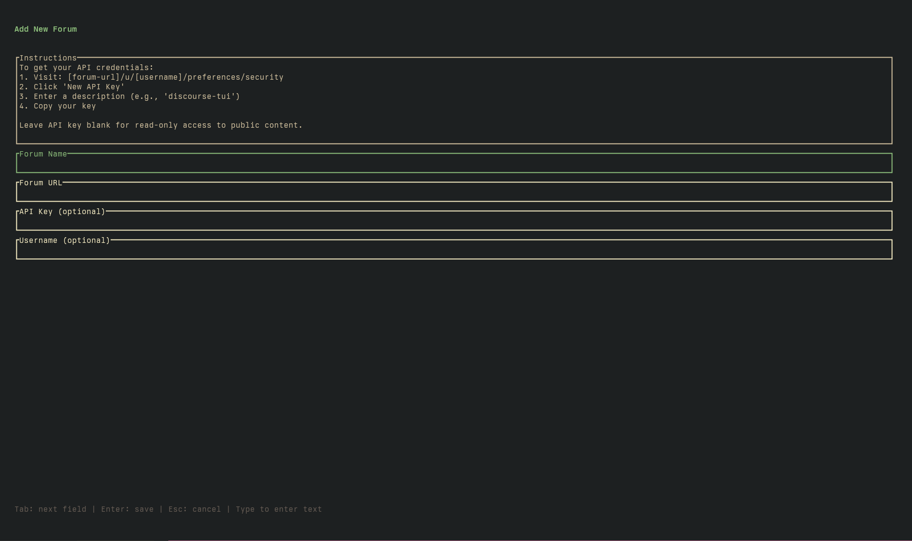
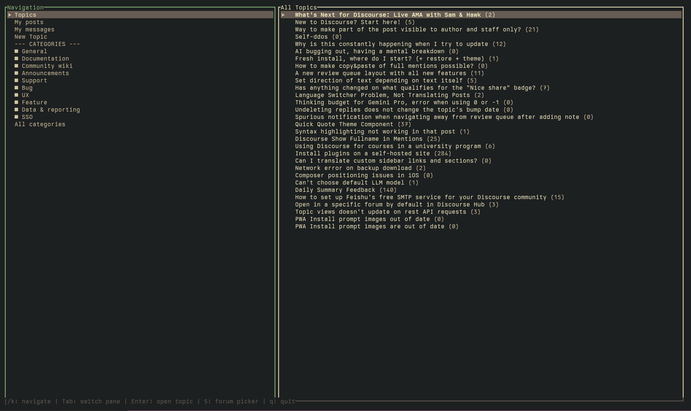
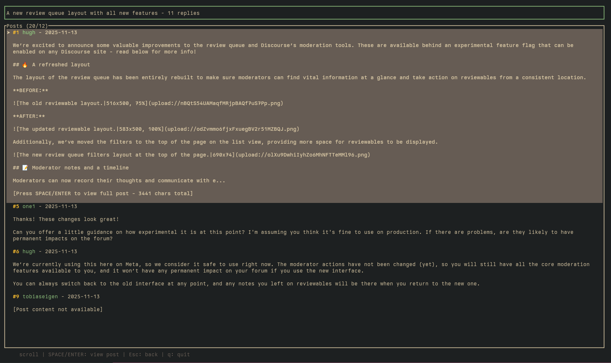

# discourse-tui

A terminal user interface for browsing Discourse forums.

## Screenshots

**Forum Picker**



**Add Forum**



**Main Screen**



**Topic View**



## Features

- Browse multiple Discourse instances
- View topics and posts with raw markdown display
- Category filtering with real API queries
- Full post view for long content
- Vim-style keybindings (j/k navigation)
- Config file storage for API credentials

## Installation

### From source

```bash
git clone https://github.com/ducks/discourse-tui
cd discourse-tui
cargo build --release
./target/release/discourse-tui
```

### From releases

Download the latest binary for your platform from the
[releases page](https://github.com/ducks/discourse-tui/releases).

## Usage

On first run, you'll be prompted to add a forum. You can add multiple forums
and switch between them.

### Keybindings

**Forum Picker (Screen 5)**
- `j/k` or arrow keys: Navigate forums
- `a`: Add new forum
- `d`: Delete selected forum
- `Enter`: Select forum
- `1`: Switch to main screen (if forum selected)
- `q`: Quit

**Main Screen (Screen 1)**
- `j/k` or arrow keys: Navigate topics/sidebar
- `Tab`: Switch between sidebar and topics
- `Enter`: Open selected topic or apply filter
- `5`: Switch to forum picker
- `Esc`: Return to forum picker
- `q`: Quit

**Topic View**
- `j/k` or arrow keys: Navigate posts
- `Space` or `Enter`: View full post
- `Esc`: Return to main screen
- `q`: Quit

**Post View**
- `j/k` or arrow keys: Scroll post
- `Esc`: Return to topic view
- `q`: Quit

## Configuration

Forums are stored in `~/.config/discourse-tui/config.toml`:

```toml
[current]
selected = "meta"

[[forums]]
id = "meta"
name = "Discourse Meta"
url = "https://meta.discourse.org"
api_key = "your-api-key"  # optional
username = "your-username"  # optional
```

### Getting API Keys

To browse private forums or post content, you'll need an API key:

1. Go to your forum's user preferences
2. Navigate to the API section
3. Generate a new user API key
4. Add it to the config along with your username

Anonymous browsing works for public forums without API credentials.

## Dependencies

Built with:
- [ratatui](https://github.com/ratatui-org/ratatui) - Terminal UI framework
- [discourse-api-rs](https://github.com/ducks/discourse-api-rs) - Discourse API
  client
- [tokio](https://tokio.rs/) - Async runtime
- [serde](https://serde.rs/) - Config serialization

## License

MIT
